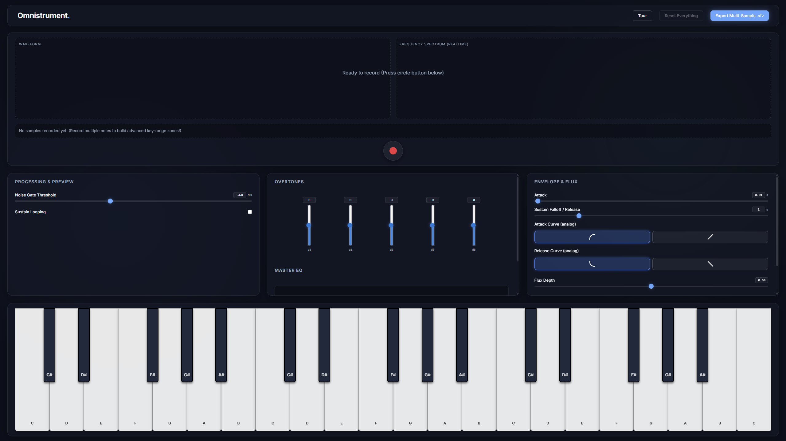
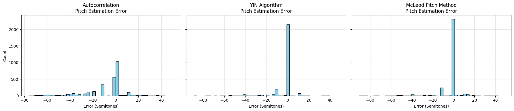
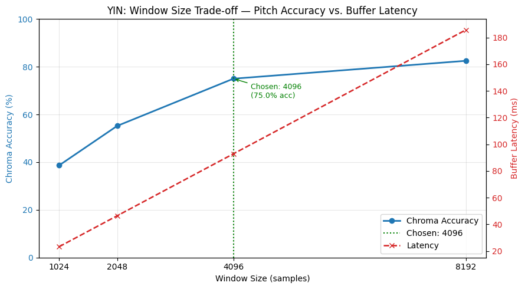

# 🎹 Omnistrument

**A browser-based synthesizer that transforms everyday sounds into playable digital instruments.**

Record any sound, map it across a virtual keyboard, sculpt it with DSP effects, and export a studio-ready `.sfz` file for your DAW — all without installing a single app.

🔗 **[Try it live →](https://omnistrument.vercel.app)**

---

---

## ✨ Features

- 🎤 **Record** any audio directly in the browser
- 🎹 **Map** your recording across a full musical keyboard with intelligent pitch-shifting
- 🎛️ **Shape** your sound with built-in DSP effects (reverb, filter, ADSR envelope)
- 💾 **Export** a portable `.sfz` instrument file compatible with any major DAW
- ⚡ **Real-time** pitch detection powered by the YIN algorithm — no backend, no latency

---

## 🔬 How Pitch Detection Works

Omnistrument uses the **YIN algorithm** to detect the fundamental frequency of your recorded sample in real time. This allows the app to correctly shift the pitch of your recording when you play different notes on the keyboard.

### Why YIN and not CREPE or another deep learning model?

The Web Audio API processes audio in fixed-size buffers (~92 ms at 4096 samples / 44.1 kHz). A pitch detector must run **faster than the buffer arrives** to avoid dropped frames. CREPE requires a ~90 MB model download and takes 80–150 ms per frame in WebAssembly — far too slow. YIN runs in **< 20 ms** and achieves comparable accuracy.

### Benchmark Results (NSynth Test Set, ~3,200 samples)

| Algorithm | Raw Pitch Accuracy | Chroma Accuracy | Avg. Latency |
|---|---|---|---|
| Autocorrelation (baseline) | 50.4% | 70.7% | ~7 ms |
| **YIN (chosen)** | **75.1%** | **87.7%** | **~19 ms** |
| McLeod Pitch Method | 72.4% | 83.6% | ~40 ms |

> YIN's 87.7% chroma accuracy is on par with published pYIN benchmarks (~74.3% RPA) on NSynth, while staying well within real-time constraints.

### Window Size Trade-off

A larger analysis window improves accuracy for low-frequency notes, but increases buffering latency. The chart below shows why **4096 samples** was chosen — it provides a steep accuracy gain over 2048 while keeping the buffer latency at 92.8 ms, well below the threshold of human perception.

---

## 🛠️ Tech Stack

- **Frontend:** React + TypeScript + Vite
- **Audio:** Web Audio API, ScriptProcessorNode / AudioWorklet
- **Pitch Detection:** Custom YIN implementation in TypeScript
- **Deployment:** Vercel

---

## 💬 Feature Requests & Feedback

Have an idea or found a bug? **[Open an issue](https://github.com/adityaroy10/Omnistrument/issues/new)** — all feature requests are welcome!

---

## 📄 License

MIT
